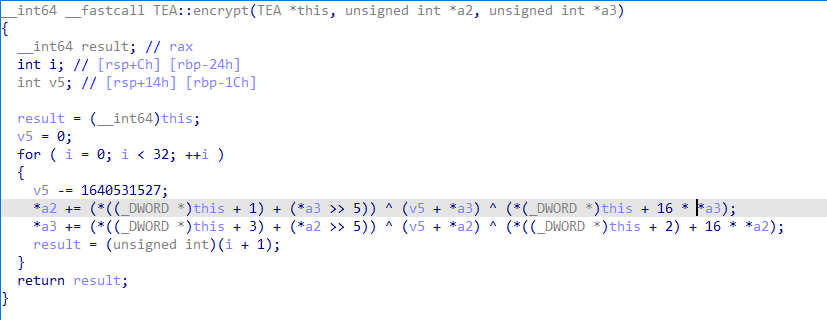
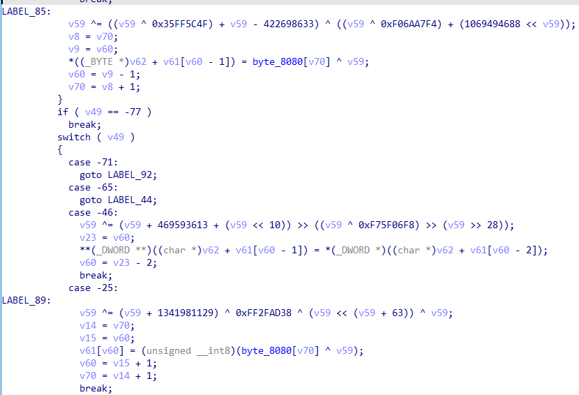
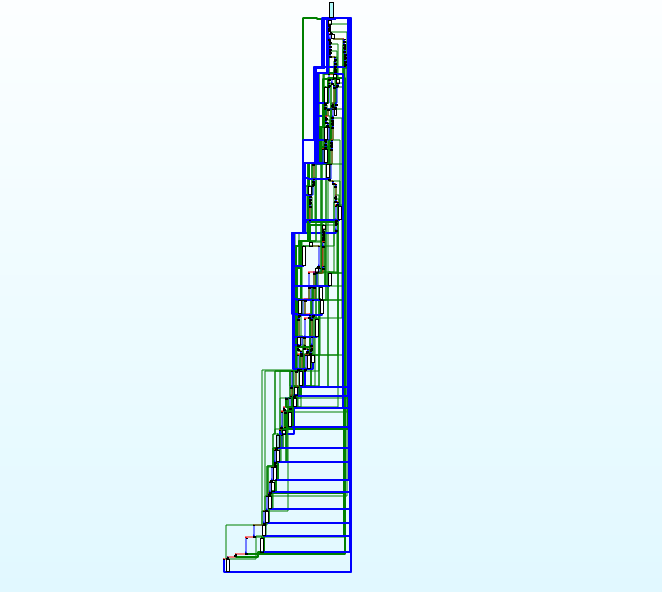
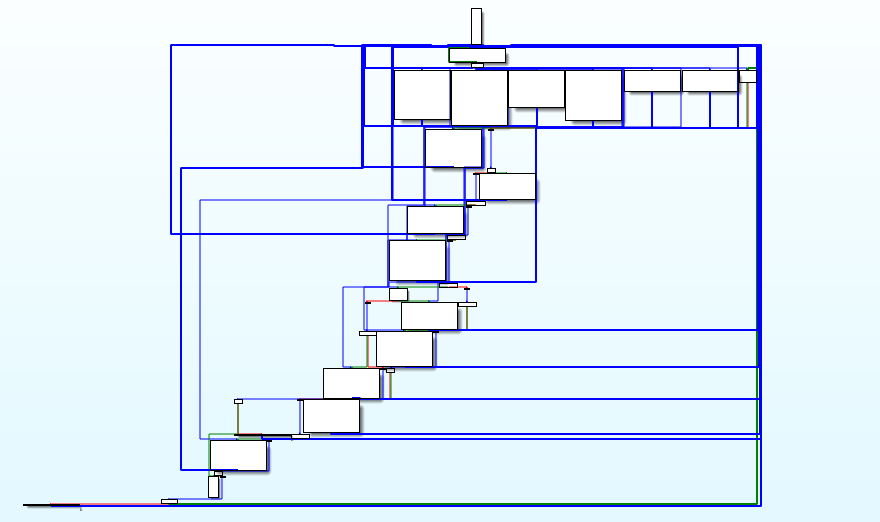
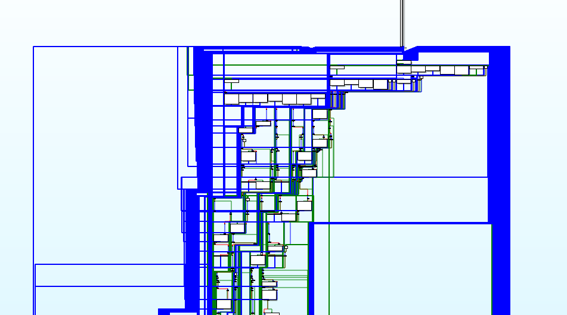
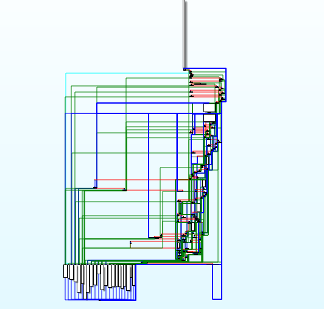
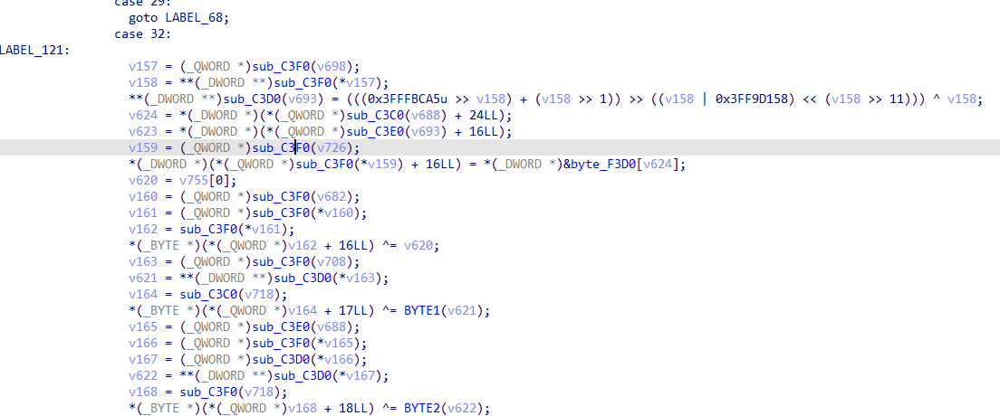

# AdaptVM

AdaptVM is a function-adaptive code virtualizer based on LLVM (16.0.6). It takes selected LLVM IR functions, derives a semantic instruction set for each function, translates them into VM bytecode, and auto-generates a per-function virtual machine (dispatcher + handlers) to execute the bytecode. Using AdaptVM as your compiler's obfuscation backend can significantly increase the difficulty of reverse engineering and cumulative devirtualization attacks.

> **Repository**: https://github.com/archergz233/AdaptVM 
>
> **Screencast**: https://youtu.be/uEprmbL_SLc

---

## Features

Compared with OLLVM-style template obfuscators and existing virtualization tools (e.g., Tigress, xVMP, VMprotect), AdaptVM tends to focus on:

- **Per-function diversity** instead of a single, fixed VM template.
- **Configurable protection level** via pass ordering and function selection.
- **Good composability** with other obfuscation passes (e.g., flattening, BCF).
- **Portability** across architectures and languages that use LLVM IR.

### 0x1 IR Level Virtualization

- **Semantic Instruction Set Extraction**  
  For each protected function, AdaptVM scans its LLVM IR and collects a set of *semantic instructions* that represent the function's core behavior. Semantically equivalent instructions are merged so that each function obtains a compact, unique instruction set.

- **Per-function VM Generation**  
  AdaptVM synthesizes a dedicated virtual machine for each target function:
  - Virtual registers and internal VM state.
  - A handler function for each semantic instruction.
  - A dispatcher that maps opcodes to handlers.
  This per-function VM design limits cross-function similarity and knowledge reuse.


- **Randomized Multibyte Dispatcher**  
Instead of a simple `switch(opcode)` dispatcher, AdaptVM builds a *multi-byte hierarchical dispatcher*. Each byte read from the bytecode drives a nested switch; multiple opcode sequences can map to the same handler. This:
  - Increases structural diversity between functions.
  - Reduces stable patterns exploitable by similarity-based devirtualization.

- **Encrypted Opcodes and Operands**  
  Opcodes and operands are stored in encoded form. The dispatcher and handlers maintain a dynamic key; each step updates the key and decodes bytecode fields on the fly, making frequency analysis and pattern matching harder.

- **Bytecode Translation**  
  The original IR of a protected function is replaced by:
  - A VM entry stub (initializes VM state and jumps into dispatcher).
  - A reference to generated bytecode.  
  All original instructions are translated into bytecode sequences (opcode + serialized operands) that only make sense inside the corresponding VM .

### 0x2 Obfuscation Pipeline & Composability

AdaptVM is implemented as an LLVM pass and can be placed at different positions in the pass pipeline. Conceptually, we have:

- **Pre-AdaptVM passes** (e.g., FLA, BCF, SUB) that transform the original code before it is virtualized mainly affect the *bytecode structure*.
- **Post-AdaptVM passes** that transform the the generated VM code – mainly affect the *despatcher and handlers*.

By changing where AdaptVM is inserted, you can:

- Emphasize **bytecode protection** (more transformations before virtualization).
- Emphasize **VM code protection** (more transformations after virtualization).
- Or combine both for a stronger, more expensive configuration.

Tipical composite configurations:

- `vmp` (baseline virtualization)
- `fla,vmp`
- `vmp,fla`.
- `fla,bcf,vmp`.
- `fla,vmp,fla`. (both bytecode and VM code flattened)

### 0x3 Portability & Compatibility

- **LLVM+native**: Implemented as an LLVM IR pass, AdaptVM works with any frontend (e.g., Clang for C/C++) and backend that shares LLVM IR.
- **Cross-architecture**: Once integrated into your toolchain, the same virtualizer design can protect code compiled to different architectures (x86-64, ARM, etc.).
- **Nested virtualization & composition**: The design supports nested virtualization and remains compatible with other obfuscation transformations, which is validated on real-world code in the paper.

---

## Build

**Use build.sh to build the obfuscator or you can follow the instructions below to build according to your needs.**   

**Note: please make sure -DLLVM_ENABLE_ASSERTIONS=Off.** **Since AdaptVM is built entirely on top of the LLVM project, please refer to the official LLVM documentation for detailed build and compilation instructions.**

Then Configure and build LLVM and Clang:

* ``cd llvm-project``

* ``cmake -S llvm -B build -G <generator> [options]``

   Some common build system generators are:

   * ``Ninja`` --- for generating [Ninja](https://ninja-build.org)
     build files. Most llvm developers use Ninja.
   * ``Unix Makefiles`` --- for generating make-compatible parallel makefiles.
   * ``Visual Studio`` --- for generating Visual Studio projects and
     solutions.
   * ``Xcode`` --- for generating Xcode projects.

   Some common options:

   * ``-DLLVM_ENABLE_PROJECTS='...'`` and ``-DLLVM_ENABLE_RUNTIMES='...'`` ---
     semicolon-separated list of the LLVM sub-projects and runtimes you'd like to
     additionally build. ``LLVM_ENABLE_PROJECTS`` can include any of: clang,
     clang-tools-extra, cross-project-tests, flang, libc, libclc, lld, lldb,
     mlir, openmp, polly, or pstl. ``LLVM_ENABLE_RUNTIMES`` can include any of
     libcxx, libcxxabi, libunwind, compiler-rt, libc or openmp. Some runtime
     projects can be specified either in ``LLVM_ENABLE_PROJECTS`` or in
     ``LLVM_ENABLE_RUNTIMES``.

     For example, to build LLVM, Clang, libcxx, and libcxxabi, use
     ``-DLLVM_ENABLE_PROJECTS="clang" -DLLVM_ENABLE_RUNTIMES="libcxx;libcxxabi"``.

   * ``-DCMAKE_INSTALL_PREFIX=directory`` --- Specify for *directory* the full
     path name of where you want the LLVM tools and libraries to be installed
     (default ``/usr/local``). Be careful if you install runtime libraries: if
     your system uses those provided by LLVM (like libc++ or libc++abi), you
     must not overwrite your system's copy of those libraries, since that
     could render your system unusable. In general, using something like
     ``/usr`` is not advised, but ``/usr/local`` is fine.

   * ``-DCMAKE_BUILD_TYPE=type`` --- Valid options for *type* are Debug,
     Release, RelWithDebInfo, and MinSizeRel. Default is Debug.

   * ``-DLLVM_ENABLE_ASSERTIONS=On`` --- Compile with assertion checks enabled
     (default is Yes for Debug builds, No for all other build types).

 * ``cmake --build build [-- [options] <target>]`` or your build system specified above
   directly.

   * The default target (i.e. ``ninja`` or ``make``) will build all of LLVM.

   * The ``check-all`` target (i.e. ``ninja check-all``) will run the
     regression tests to ensure everything is in working order.

   * CMake will generate targets for each tool and library, and most
     LLVM sub-projects generate their own ``check-<project>`` target.

   * Running a serial build will be **slow**. To improve speed, try running a
     parallel build. That's done by default in Ninja; for ``make``, use the option
     ``-j NNN``, where ``NNN`` is the number of parallel jobs to run.
     In most cases, you get the best performance if you specify the number of CPU threads you have.
     On some Unix systems, you can specify this with ``-j$(nproc)``.

 * For more information see [CMake](https://llvm.org/docs/CMake.html).

Consult the
[Getting Started with LLVM](https://llvm.org/docs/GettingStarted.html#getting-started-with-llvm)
page for detailed information on configuring and compiling LLVM. You can visit
[Directory Layout](https://llvm.org/docs/GettingStarted.html#directory-layout)
to learn about the layout of the source code tree.

---

## Usage

### 1. Compile with AdaptVM
you can invoke it via the new pass manager:
`clang -mllvm -passes=vmp <source.cpp> -o <target>`

To combine AdaptVM with other obfuscation passes (names may differ in your build):

`clang -mllvm -passes=fla,vmp,bcf <source.cpp> -o <target>`

- Passes placed **before** `adaptvm` mainly affect the *bytecode*.
- Passes placed **after** `adaptvm` mainly affect the *VM code*.

### 2. Select Target Functions

Usually, you only want to virtualize security-critical functions.

You can configure which obfuscation passes are applied to a function using Clang's `__annotate__` attribute. The annotation string contains a comma-separated list of options:

```c
__attribute__((__annotate__("virtualization,flatten")))
int sensitive_compute(int x, int y) {
    int z = x * 3 + y;
    return (z ^ 0xdeadbeef);
}
```

In this example, the annotation string `"virtualization,flatten"` encodes two options:-

- `virtualization` – enable the virtualization backend for this function (corresponds to the `vmp` mode in the compilation options).
- `flatten` – additionally apply control-flow flattening to this function.

Multiple options must be separated by commas. The pass parses the annotation string, splits it on `,`, and then enables the corresponding obfuscation passes for the annotated function.

**Note:** The *order* of options inside the annotation string (e.g., `"virtualization,flatten"` vs. `"flatten,virtualization"`) does **not** matter. The actual pass order is defined globally by the LLVM pass pipeline on the command line. The annotation only controls **which** passes are enabled for a given function, while **in which order** those passes run is determined by `-passes=...` on the command line.

## Examples

This section shows how to protect the sources in the examples directory with AdaptVM and how the resulting binary differs from a normal build.

- If you are using a precompiled package (should run on Ubuntu20.04 or WSL), it is usually located in the `bin` directory after extraction.
- If you built LLVM/Clang from source, you should find it under `src/build/bin`.

- There are two example  source files in the `examples` directory, and the relevant functions have already been annotated. You can compile them using the following commands.

  ```
  /path/to/clang -mllvm -passes=vmp,fla example.cpp -o example_bin
  ```

- Then you will obtain the obfuscated binary. Use a decompiler (e.g IDA/Binary Ninja/Ghidra) to inspect what exactly has been transformed.

**1.Original Program:**

use command `clang++ example2.cpp -o example2_bin_orig`  to get the program without obfuscation. Then we used IDA to analyze the  binary file, and we found that function could be easily decompiled into  pseudocode, which is very similar to source code.



**2.Program Obfuscated With AdaptVM:**

The same source code is compiled with AdaptVM with the *vmp* option enabled, and the resulting binary `example2_bin_obfu` is then analyzed in IDA.The original functions are replaced by virtual machine functions whose names end with `_VM`.

It can be observed that the original function logic has been replaced by the virtual machine logic, and its key characteristics can no longer be identified.

The code of individual VM functions is mutually distinct, which can be clearly seen from their control-flow graphs.







**3.Program Obfuscated With AdaptVM and other obfuscation:**

By enabling additional obfuscation options, either the virtual machine or its bytecode can be further obfuscated. Since obfuscating the bytecode alone has only a limited observable impact, we instead evaluate the effect of obfuscating the virtual machine.




It can be observed that the handler code has been further obfuscated.


